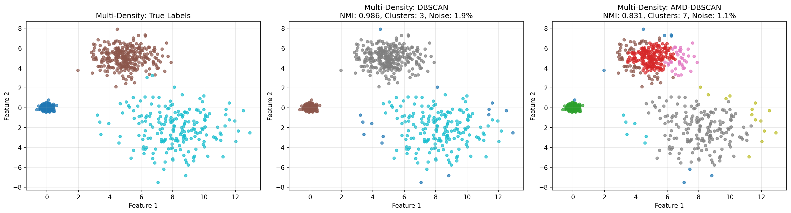
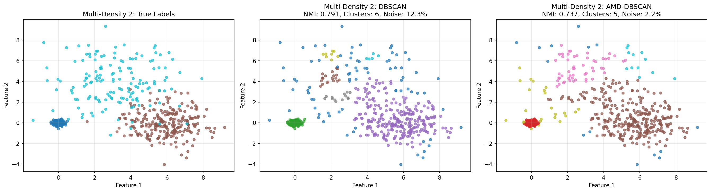
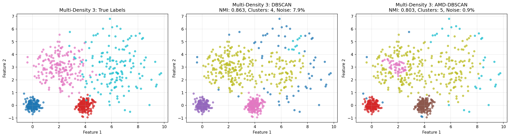
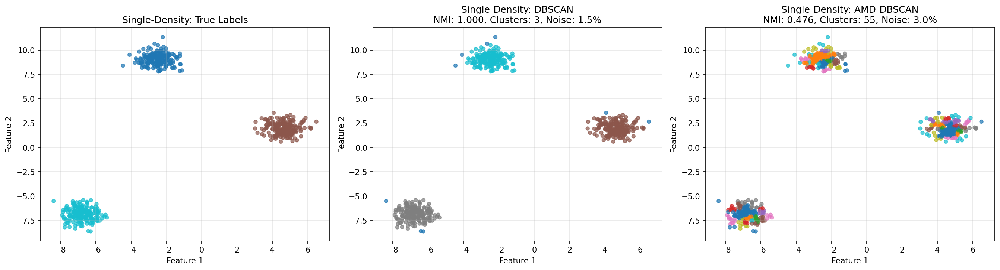

# DBSCAN vs AMD-DBSCAN Example

Ten plik przedstawia przykładowe wyniki porównania algorytmów **DBSCAN** i **AMD-DBSCAN** na różnych zbiorach danych o pojedynczej i wielokrotnej gęstości.

---

## Multi-Density Dataset

- **Kształt zbioru danych:** (800, 2)  
- **Liczba prawdziwych klastrów:** 3  

### DBSCAN
- Najlepsze parametry: eps=1.0, min_pts=5  
- NMI: 0.9863  
- ARI: 0.9931  
- Liczba klastrów: 3  
- Noise ratio: 1.88%  

### AMD-DBSCAN
- Czas wykonania: 1.84s  
- NMI: 0.8312  
- ARI: 0.8140  
- Liczba klastrów: 7  
- Noise ratio: 1.12%  
- VNN (Variance of Neighbors): 417.92  
- Adaptive k: 20  
- Candidate Eps: ['0.245', '0.977', '2.003']  

**Porównanie:**  
- NMI improvement: -0.1551 (-15.7%)  

---

## Multi-Density Dataset 2

- **Kształt zbioru danych:** (650, 2)  
- **Liczba prawdziwych klastrów:** 3  

### DBSCAN
- Najlepsze parametry: eps=0.5, min_pts=5  
- NMI: 0.7905  
- ARI: 0.8441  
- Liczba klastrów: 6  
- Noise ratio: 12.31%  

### AMD-DBSCAN
- Czas wykonania: 0.45s  
- NMI: 0.7371  
- ARI: 0.7589  
- Liczba klastrów: 5  
- Noise ratio: 2.15%  
- VNN (Variance of Neighbors): 899.73  
- Adaptive k: 20  
- Candidate Eps: ['0.106', '0.750', '1.626']  

**Porównanie:**  
- NMI improvement: -0.0535 (-6.8%)  

---

## Multi-Density Dataset 3 (4 clusters)

- **Kształt zbioru danych:** (750, 2)  
- **Liczba prawdziwych klastrów:** 4  

### DBSCAN
- Najlepsze parametry: eps=0.5, min_pts=5  
- NMI: 0.8628  
- ARI: 0.8181  
- Liczba klastrów: 4  
- Noise ratio: 7.87%  

### AMD-DBSCAN
- Czas wykonania: 0.48s  
- NMI: 0.8032  
- ARI: 0.7250  
- Liczba klastrów: 5  
- Noise ratio: 0.93%  
- VNN (Variance of Neighbors): 23.79  
- Adaptive k: 20  
- Candidate Eps: ['0.226', '0.785', '1.715']  

**Porównanie:**  
- NMI improvement: -0.0596 (-6.9%)  

---

## Single-Density Dataset

- **Kształt zbioru danych:** (600, 2)  
- **Liczba prawdziwych klastrów:** 3  

### DBSCAN
- Najlepsze parametry: eps=0.5, min_pts=5  
- NMI: 1.0000  
- ARI: 1.0000  
- Liczba klastrów: 3  
- Noise ratio: 1.50%  

### AMD-DBSCAN
- Czas wykonania: 0.37s  
- NMI: 1.0000  
- ARI: 1.0000  
- Liczba klastrów: 3  
- Noise ratio: 24.17%  
- VNN (Variance of Neighbors): 1.93  
- Adaptive k: 20  
- Candidate Eps: ['0.378']  

**Porównanie:**  
- NMI improvement: -0.0000 (-0.0%)  

---

## Podsumowanie wyników

| Dataset                     | DBSCAN NMI | AMD-DBSCAN NMI | Improvement |
|------------------------------|------------|----------------|-------------|
| Multi-Density Dataset        | 0.9863     | 0.8312         | -15.7%      |
| Multi-Density Dataset 2      | 0.7905     | 0.7371         | -6.8%       |
| Multi-Density Dataset 3      | 0.8628     | 0.8032         | -6.9%       |
| Single-Density Dataset       | 1.0000     | 1.0000         | -0.0%       |
